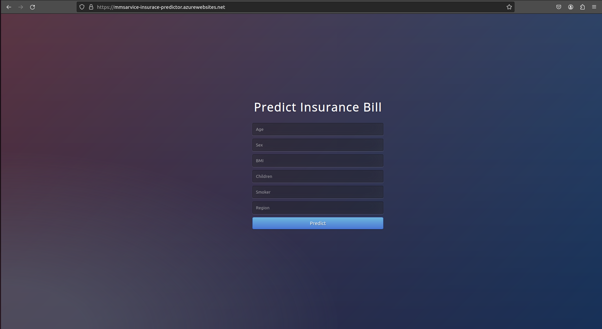

# Insurance Amount Prediction Web Application

This is a web application for predicting insurance amounts using a Gradient Boosting Regressor model trained on the PyCaret library. The application utilizes Flask as the backend and is hosted on Azure Web App Service using Docker containers.

## Usage

To use this web application, follow these steps:

1. Navigate to the hosted website URL.
2. Enter the required input features, such as age, BMI, smoking status, etc.
3. Click on the "Predict" button to generate the predicted insurance amount.
4. The predicted insurance amount will be displayed on the webpage.

## Deployment

The deployment process involves the following steps:

1. Model Training: Train the Gradient Boosting Regressor model using PyCaret with the inbuilt insurance dataset.

2. Backend Development: Develop the backend using Flask to handle HTTP requests and serve predictions using the trained model.

3. Frontend Development: Create a simple HTML/CSS frontend to collect user input and display predictions.

4. Dockerization: Dockerize the application using a Dockerfile to create a container image.

5. Azure Container Registry: Push the Docker image to Azure Container Registry (ACR) on your Azure account.

6. Azure Web App Service: Create a web app on Azure using the container image from the ACR.

7. Hosting: Host the web application on Azure Web App Service, making it accessible via a public URL.

## Technologies Used

- Python
- PyCaret
- Flask
- HTML/CSS
- Docker
- Azure Container Registry
- Azure Web App Service

## Docker Part

## Azure Resources

## Website

[Predictor_Website](https://mmsarvice-insurace-predictor.azurewebsites.net/)

